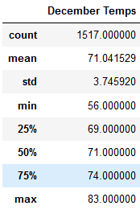

# Surfs_Up

## Analysis

This is an analysis of temperatures in Oahu, HI to determine whether 
W. Avy's ice cream and surf shop can sustain itself all year.

- Temperatures are on average higher in June when compared to December by about 4 degrees 
- Temperatures in June tend to vary less when compared to December by around .5 degrees.
- The maximum temperature in June is higher when compared to December by 2 degrees

## Conclusion

Overall temperatures are certainly higher in June, suggesing that W. may sell more ice cream
in June as opposed to December, and additionally receive more foot traffic from surfers due to
warmer weather. However the difference in temperatures is not much so W. should plan to keep his
surf shop open year round for all of those winter surfers and tourists in sunny Hawaii.

### Queries Used
(Query June Weather)
- session.query(Measurement.tobs).filter(extract('month', Measurement.date)==6).all()
(Query December Weather)
- session.query(Measurement.tobs).filter(extract('month', Measurement.date)==12).all()
